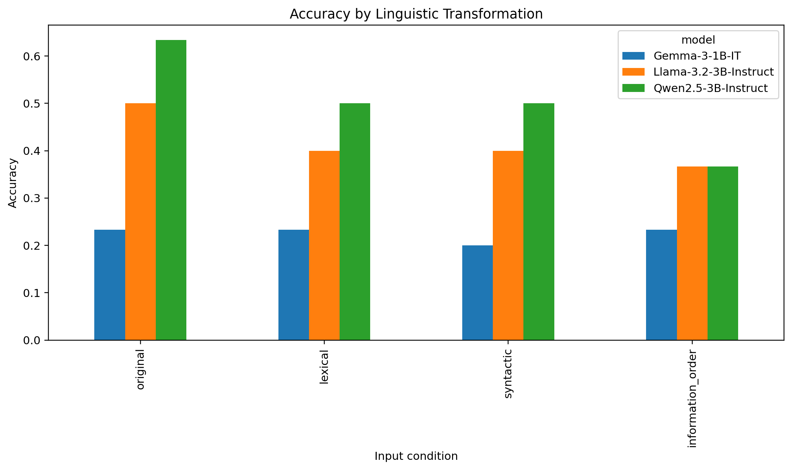
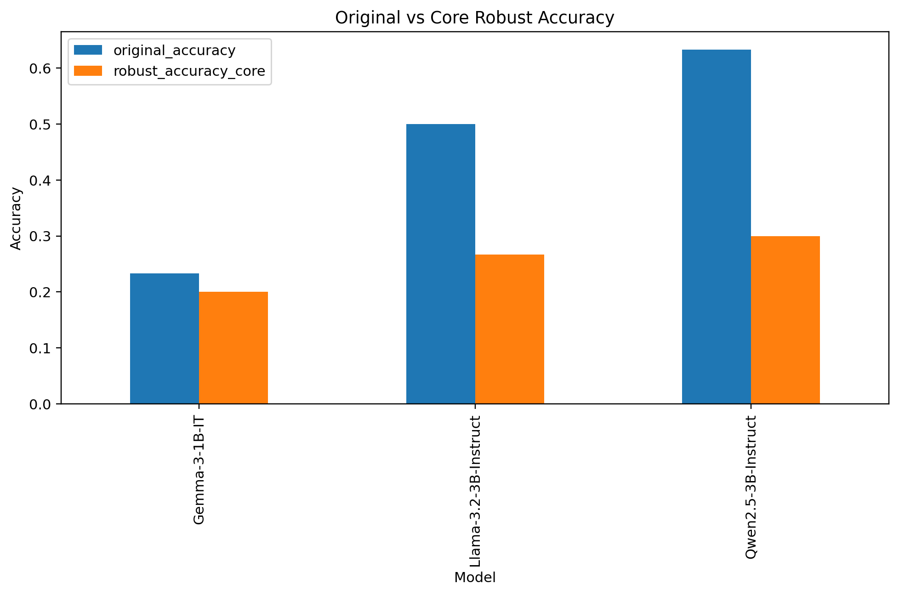
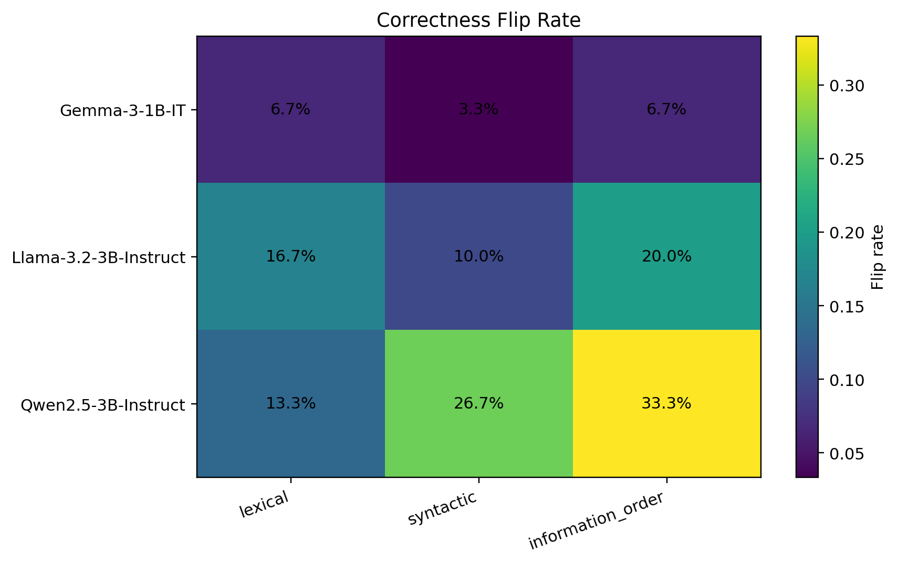

# ReasonShift

## Same Meaning, Different Answer?
### Evaluating LLM Robustness to Meaning-Preserving Linguistic Transformations

ReasonShift is an empirical NLP study of **linguistic robustness in small open-source instruction-tuned language models**. It asks whether a model that solves a reasoning problem correctly continues to do so when the same meaning is expressed with different wording, syntax, or information order.

The study evaluates **Qwen2.5-3B-Instruct, Llama-3.2-3B-Instruct, and Gemma-3-1B-IT** on meaning-preserving reformulations of **CommonsenseQA, GSM8K, and LogiQA**. The final quality-controlled benchmark contains **30 question groups, 120 inputs per model, and 360 total model responses**. In addition to standard accuracy, ReasonShift measures paired correctness changes and strict robust accuracy to reveal instability that aggregate benchmark scores can hide.

---

# 2. Research Question

The primary research question is:

> **Do small open-source instruction-tuned LLMs preserve reasoning behaviour when the same problem is expressed using controlled, meaning-equivalent linguistic forms?**

The study additionally investigates:

1. How much does accuracy change under lexical, syntactic, and information-order transformations?
2. How frequently does a model change from correct to incorrect or incorrect to correct after reformulation?
3. Which transformation types produce the greatest descriptive instability?
4. Does conventional accuracy conceal instability at the individual question level?
5. How much model performance remains robust when correctness is required across all formulations of a question?

---

# 3. Hypothesis

The study tests the following hypothesis:

> **Small open-source language models exhibit instance-level reasoning instability under controlled meaning-preserving linguistic transformations, and aggregate benchmark accuracy can hide this linguistic fragility.**

Under a perfectly robust system, meaning-preserving transformations should not alter the correctness of the model's answer.

---

# 4. Experimental Overview


| Component | Final Experiment |
|---|---:|
| Original question groups | 30 |
| CommonsenseQA groups | 10 |
| GSM8K groups | 10 |
| LogiQA groups | 10 |
| Formulations per group | 4 |
| Inputs per model | 120 |
| Models | 3 |
| **Total model responses** | **360** |

Each question group contains one original formulation and three meaning-preserving transformations:

- **Original:** unchanged benchmark question used as the reference.
- **Lexical:** wording is paraphrased while preserving meaning and the correct answer.
- **Syntactic:** grammatical structure is changed without changing the facts or reasoning requirement.
- **Information order:** the same information is presented in a different sequence while preserving the required conclusion.

Thus, `30 groups × 4 formulations = 120 inputs per model`, and `120 inputs × 3 models = 360 responses`.

---

---
## 5. Methodology

### 5.1 Datasets

| Dataset | Reasoning focus | Groups | Inputs |
|---|---|---:|---:|
| **CommonsenseQA** | Commonsense multiple-choice reasoning | 10 | 40 |
| **GSM8K** | Mathematical word-problem reasoning | 10 | 40 |
| **LogiQA** | Logical and deductive reasoning | 10 | 40 |
| **Total** | — | **30** | **120** |

The final quality-controlled dataset is stored at `data/validated/reasonshift_dataset.csv`.

### 5.2 Transformation Quality Control

Meaning preservation is essential: a transformation must not change the correct answer, remove necessary information, introduce new facts, or leak the answer. Validation considered semantic equivalence, answer preservation, transformation-type validity, fluency, and answer leakage.

A stratified sample of **45 transformed inputs** was manually audited.

| Human-audit measure | Result |
|---|---:|
| Transformations audited | 45 |
| Reviewed | 45/45 |
| Accepted | 45/45 |
| Acceptance rate | **100%** |

Audit artifacts are available in `audit/`, and transformation criteria are documented in `annotations/transformation_guidelines.md`.

### 5.3 Models and Inference

| Model | Hugging Face checkpoint |
|---|---|
| Qwen2.5-3B-Instruct | `Qwen/Qwen2.5-3B-Instruct` |
| Llama-3.2-3B-Instruct | `meta-llama/Llama-3.2-3B-Instruct` |
| Gemma-3-1B-IT | `google/gemma-3-1b-it` |

Inference used deterministic decoding with `do_sample = false`, `max_new_tokens = 32`, and final-answer-only evaluation. Each model received the same 120 inputs. Raw generations are retained in `outputs/generations/`, parsed predictions in `outputs/parsed/`, and exact model configuration in `configs/models.json`.

---

# 6. Linguistic Transformations

Each original question belongs to a `group_id` and is associated with three controlled reformulations.

The four experimental conditions are:

```text
Original
Lexical
Syntactic
Information Order
```

## 6.1 Original

The unmodified benchmark question serves as the reference formulation.

---

## 6.2 Lexical Transformation

Lexical transformations modify wording while preserving the intended meaning.

Examples include:

- replacing words or phrases with contextually appropriate alternatives;
- changing surface wording;
- paraphrasing expressions without altering the underlying reasoning task.

The correct answer must remain unchanged.

---

## 6.3 Syntactic Transformation

Syntactic transformations alter grammatical structure while attempting to preserve semantic content.

Examples include:

- changing clause structure;
- reorganizing grammatical construction;
- modifying sentence structure without changing the facts or reasoning requirements.

---

## 6.4 Information-Order Transformation

Information-order transformations change the sequence in which relevant information is presented while preserving the same facts, constraints, and required conclusion.

This condition tests whether models depend on the presentation order of information rather than only its semantic content.

---

# 7. Transformation Quality Control

Meaning preservation is essential to the experiment.

If a transformation changes the correct answer, removes necessary information, introduces new facts, or leaks the answer, then a changed model prediction cannot legitimately be interpreted as linguistic instability.

The final dataset therefore underwent quality control before final evaluation.

Transformation validation considered:

- semantic equivalence;
- answer preservation;
- transformation-type validity;
- fluency;
- answer leakage.

A stratified sample of **45 transformed inputs** was manually audited.

## Human Audit Results

| Audit measure | Result |
|---|---:|
| Transformations audited | 45 |
| Reviewed | 45/45 |
| Accepted | 45/45 |
| Acceptance rate | 100% |

The audit documentation is stored in:

```text
audit/
├── human_audit_45.csv
├── automated_structural_checks.csv
├── final_audit_acceptance_summary.csv
└── FINAL_AUDIT_STATUS.json
```

The transformation criteria are documented in:

```text
annotations/transformation_guidelines.md
```

---

# 8. Final ReasonShift Dataset

The final quality-controlled dataset is:

```text
data/validated/reasonshift_dataset.csv
```

Its structure is:

| Dataset | Groups | Original | Lexical | Syntactic | Information Order | Total |
|---|---:|---:|---:|---:|---:|---:|
| CommonsenseQA | 10 | 10 | 10 | 10 | 10 | 40 |
| GSM8K | 10 | 10 | 10 | 10 | 10 | 40 |
| LogiQA | 10 | 10 | 10 | 10 | 10 | 40 |
| **Total** | **30** | **30** | **30** | **30** | **30** | **120** |

A dataset manifest is provided at:

```text
data/validated/reasonshift_dataset_manifest.txt
```

---

# 9. Evaluated Models

Three open-source instruction-tuned models were evaluated.

| Model | Checkpoint |
|---|---|
| Qwen2.5-3B-Instruct | `Qwen/Qwen2.5-3B-Instruct` |
| Llama-3.2-3B-Instruct | `meta-llama/Llama-3.2-3B-Instruct` |
| Gemma-3-1B-IT | `google/gemma-3-1b-it` |

Exact model configuration is stored in:

```text
configs/models.json
```

The model configuration uses:

```text
max_new_tokens = 32
trust_remote_code = false
```

---

# 10. Inference Setup

The experiment uses deterministic decoding:

```text
do_sample = false
final_answer_only = true
```

The purpose is to reduce sampling-related variation so that observed changes can be more directly associated with differences in input formulation.

Each model receives the same 120 final inputs.

This produces:

```text
Qwen:  120 responses
Llama: 120 responses
Gemma: 120 responses
--------------------
Total: 360 responses
```

Raw generations are retained in:

```text
outputs/generations/
```

Parsed outputs are retained in:

```text
outputs/parsed/
```

This allows the reported results to be traced back to the generated model responses.

---

# 11. Evaluation Metrics

ReasonShift evaluates both conventional performance and paired robustness.

## 11.1 Accuracy

Standard answer accuracy:

```text
Accuracy = Correct predictions / Total predictions
```

Accuracy is calculated:

- overall;
- by model;
- by dataset;
- by transformation condition.

---

## 11.2 Accuracy Delta

For transformation \(t\):

```text
Accuracy Delta(t)
= Accuracy(t) - Accuracy(original)
```

A negative value indicates lower accuracy after transformation.

---

## 11.3 Correctness Flip Rate

A correctness flip occurs when the correctness state changes between the original and transformed question:

```text
Correct → Wrong
```

or

```text
Wrong → Correct
```

The flip rate therefore captures instance-level instability that aggregate accuracy can hide.

---

## 11.4 Degradation Rate

The degradation rate measures:

```text
Correct → Wrong
```

transitions.

These cases are particularly relevant because the model originally solved the problem but failed after a meaning-preserving reformulation.

---

## 11.5 Recovery Rate

The recovery rate measures:

```text
Wrong → Correct
```

transitions.

These cases show that reformulation can sometimes improve model performance.

---

## 11.6 Robust Accuracy

ReasonShift uses a strict group-level robustness criterion.

A question group is considered robustly correct only when the model answers:

```text
Original            ✓
Lexical             ✓
Syntactic           ✓
Information Order   ✓
```

correctly.

Therefore:

```text
Robust Accuracy
= groups correct under all four formulations
  / total question groups
```

This is deliberately stricter than standard accuracy.

---

# 12. Statistical Analysis

Because every transformed question is paired with its original version, the experiment uses paired statistical analysis.

## 12.1 Exact McNemar Test

The exact McNemar test evaluates whether the number of:

```text
Correct → Wrong
```

transitions differs from:

```text
Wrong → Correct
```

transitions.

This directly evaluates paired changes in correctness.

---

## 12.2 Bootstrap Confidence Intervals

Question-group bootstrap resampling is used to estimate 95% confidence intervals for accuracy differences.

This provides uncertainty estimates around observed transformation effects.

---

## 12.3 Multiple-Testing Correction

Multiple paired comparisons are performed across:

- models;
- datasets;
- transformation types.

Benjamini-Hochberg correction is therefore applied to the McNemar p-values.

Both:

```text
mcnemar_p
```

and:

```text
mcnemar_p_bh
```

are reported.

Statistical significance after correction is evaluated at:

```text
α = 0.05
```

---

# 13. Results

## 13.1 Overall Accuracy

Across all 120 formulations evaluated for each model:

| Model | Correct | Total | Overall Accuracy |
|---|---:|---:|---:|
| **Qwen2.5-3B-Instruct** | **60** | 120 | **50.0%** |
| **Llama-3.2-3B-Instruct** | **50** | 120 | **41.7%** |
| **Gemma-3-1B-IT** | **27** | 120 | **22.5%** |

Qwen achieved the highest overall accuracy, followed by Llama and Gemma.

However, overall accuracy alone does not describe whether these predictions remain stable across alternative formulations.

---

# 14. Accuracy by Linguistic Condition

| Model | Original | Lexical | Syntactic | Information Order |
|---|---:|---:|---:|---:|
| **Qwen2.5-3B-Instruct** | **63.3%** | 50.0% | 50.0% | **36.7%** |
| **Llama-3.2-3B-Instruct** | **50.0%** | 40.0% | 40.0% | **36.7%** |
| **Gemma-3-1B-IT** | **23.3%** | 23.3% | 20.0% | 23.3% |

The corresponding figure is shown below.



### Observations

For Qwen:

- Original → Lexical: **−13.3 percentage points**
- Original → Syntactic: **−13.3 percentage points**
- Original → Information Order: **−26.7 percentage points**

For Llama:

- Original → Lexical: **−10.0 percentage points**
- Original → Syntactic: **−10.0 percentage points**
- Original → Information Order: **−13.3 percentage points**

Gemma's aggregate accuracy changed relatively little across conditions, but its original accuracy was already substantially lower.

---

# 15. Original Accuracy vs Robust Accuracy

The strict robustness criterion produces a different view of model performance.

| Model | Original Accuracy | Robust Accuracy | Robustness Gap |
|---|---:|---:|---:|
| **Qwen2.5-3B-Instruct** | **63.3%** | **30.0%** | **−33.3 pp** |
| **Llama-3.2-3B-Instruct** | **50.0%** | **26.7%** | **−23.3 pp** |
| **Gemma-3-1B-IT** | **23.3%** | **20.0%** | **−3.3 pp** |



This distinction is central to ReasonShift.

For example, Qwen correctly answered **63.3% of original questions**, but only **30.0% of question groups were correct under all four formulations**.

Thus, relatively strong original-form accuracy did not imply equivalent formulation robustness.

---

# 16. Correctness Flip Rates

The following table reports how often correctness changed between an original question and each transformed version.

| Model | Lexical | Syntactic | Information Order |
|---|---:|---:|---:|
| Gemma-3-1B-IT | 6.7% | 3.3% | 6.7% |
| Llama-3.2-3B-Instruct | 16.7% | 10.0% | 20.0% |
| Qwen2.5-3B-Instruct | 13.3% | 26.7% | **33.3%** |



The largest observed flip rate was:

```text
Qwen + Information Order = 33.3%
```

This means that the correctness state changed for approximately one-third of the paired Qwen questions under information-order reformulation.

---

# 17. Paired Transition Analysis

The all-dataset paired results are:

| Model | Transformation | C→W | W→C | Flip Rate | Accuracy Δ |
|---|---|---:|---:|---:|---:|
| Gemma | Lexical | 1 | 1 | 6.7% | 0.0 pp |
| Gemma | Syntactic | 1 | 0 | 3.3% | −3.3 pp |
| Gemma | Information Order | 1 | 1 | 6.7% | 0.0 pp |
| Llama | Lexical | 4 | 1 | 16.7% | −10.0 pp |
| Llama | Syntactic | 3 | 0 | 10.0% | −10.0 pp |
| Llama | Information Order | 5 | 1 | 20.0% | −13.3 pp |
| Qwen | Lexical | 4 | 0 | 13.3% | −13.3 pp |
| Qwen | Syntactic | 6 | 2 | 26.7% | −13.3 pp |
| Qwen | Information Order | **9** | **1** | **33.3%** | **−26.7 pp** |

These paired transitions show why accuracy alone is insufficient.

Two conditions can have similar aggregate accuracy while containing different individual questions that changed correctness state.

---

# 18. Statistical Results

The strongest descriptive transformation effect occurred for:

```text
Qwen2.5-3B-Instruct
Information-order transformation
```

Results:

```text
Original accuracy:          63.3%
Transformed accuracy:       36.7%
Accuracy delta:            -26.7 pp
Correctness flip rate:      33.3%
Correct → Wrong:             9
Wrong → Correct:             1
Exact McNemar p:             0.021484
BH-corrected p:              0.773438
```

Although the uncorrected exact McNemar test produced:

```text
p = 0.0215
```

the effect **did not remain statistically significant after Benjamini-Hochberg correction**.

Across the final paired comparisons:

> **No tested transformation effect was statistically significant at α = 0.05 after multiple-testing correction.**

The descriptive effects should therefore not be interpreted as conclusive population-level evidence.

Instead, the experiment provides evidence of **observable instance-level instability within the evaluated benchmark**, while the small sample size limits statistical power.

---

# 19. Main Findings

The final experiment produces four main observations.

### 1. Meaning-preserving reformulations can change model correctness

All three evaluated models exhibited at least some correctness transitions after linguistic reformulation.

### 2. Higher original accuracy does not necessarily imply greater robustness

Qwen achieved the highest original accuracy:

```text
63.3%
```

but also showed the largest gap between original and strict robust accuracy:

```text
63.3% → 30.0%
```

### 3. Information order produced the largest descriptive instability

For Qwen, information-order reformulation resulted in:

```text
33.3% correctness flip rate
```

and:

```text
−26.7 percentage-point accuracy change
```

This was the largest observed transformation effect in the final experiment.

### 4. Aggregate accuracy can hide paired instability

A model's overall accuracy does not indicate whether the same individual questions remain correctly answered after reformulation.

Correctness flip analysis therefore provides information that standard benchmark accuracy alone cannot capture.

---

# 20. Interpretation

The ReasonShift results suggest that evaluation based exclusively on a single linguistic formulation may provide an incomplete picture of model behaviour.

The most important result is not simply that transformed accuracy can be lower.

Rather, the experiment demonstrates that:

> **The correctness of individual predictions can depend on how semantically equivalent information is linguistically presented.**

This motivates evaluating language models not only for whether they answer benchmark questions correctly, but also for whether those answers remain stable across reasonable meaning-preserving formulations.

At the same time, the final benchmark is intentionally small. The observed differences should therefore be interpreted as exploratory robustness evidence rather than broad claims about all LLMs or all reasoning tasks.

---

# 21. Limitations

Several limitations should be considered.

## 21.1 Small Benchmark Size

The final experiment contains only:

```text
30 original question groups
```

with 10 groups from each dataset.

This provides a balanced controlled experiment but limits statistical power and generalizability.

---

## 21.2 Limited Model Coverage

Only three relatively small instruction-tuned open-source models were evaluated.

Results should not automatically be generalized to larger or proprietary models.

---

## 21.3 Transformation Validation

Although transformations were quality-controlled and a stratified sample of 45 transformed inputs was manually audited, the manual audit does not independently review every transformed item.

---

## 21.4 Transformation Scope

The experiment evaluates three linguistic transformation categories:

```text
lexical
syntactic
information order
```

Other meaning-preserving variations could produce different robustness patterns.

---

## 21.5 Benchmark Scope

CommonsenseQA, GSM8K, and LogiQA represent selected forms of commonsense, mathematical, and logical reasoning.

They do not cover the full range of language understanding or reasoning behaviour.

---

## 21.6 Statistical Power

No paired transformation effect remained statistically significant after Benjamini-Hochberg correction.

Therefore, descriptive effect sizes, correctness transitions, and robustness gaps are emphasized rather than claims of statistically established transformation-specific effects.

---

# 22. Reproducibility

ReasonShift retains the main artifacts necessary to inspect the final experiment:

- final quality-controlled dataset;
- transformation guidelines;
- human audit;
- experiment configuration;
- exact model checkpoints;
- transformation prompts;
- raw model generations;
- parsed predictions;
- statistical results;
- figures;
- analysis scripts.

Earlier development experiments and pre-final transformation attempts are intentionally excluded from the public repository so that they cannot be confused with the dataset and outputs used for the reported results.

---

# 23. Repository Structure

```text
ReasonShift/
│
├── annotations/
│   └── transformation_guidelines.md
│
├── audit/
│   ├── automated_structural_checks.csv
│   ├── final_audit_acceptance_summary.csv
│   ├── FINAL_AUDIT_STATUS.json
│   └── human_audit_45.csv
│
├── configs/
│   ├── experiment.json
│   └── models.json
│
├── data/
│   └── validated/
│       ├── reasonshift_dataset.csv
│       └── reasonshift_dataset_manifest.txt
│
├── figures/
│   ├── accuracy_by_transformation.png
│   ├── flip_rate_heatmap.png
│   └── original_vs_robust_accuracy.png
│
├── literature/
│   ├── literature_matrix.csv
│   └── novelty_audit.md
│
├── outputs/
│   ├── generations/
│   │   ├── gemma_3_1b_outputs.jsonl
│   │   ├── llama_3_2_3b_outputs.jsonl
│   │   └── qwen_2_5_3b_outputs.jsonl
│   │
│   └── parsed/
│       ├── gemma_3_1b_outputs_parsed.jsonl
│       ├── llama_3_2_3b_outputs_parsed.jsonl
│       └── qwen_2_5_3b_outputs_parsed.jsonl
│
├── prompts/
│   └── transformations/
│       ├── information_order.txt
│       ├── lexical.txt
│       └── syntactic.txt
│
├── results/
│   ├── accuracy_by_model_dataset_variant.csv
│   ├── accuracy_by_model_variant.csv
│   ├── analysis_summary.txt
│   ├── overall_accuracy_by_model.csv
│   ├── paired_robustness_results.csv
│   ├── robust_accuracy_results.csv
│   ├── transition_candidates.csv
│   └── transition_summary.csv
│
├── src/
│   ├── __init__.py
│   ├── analyze_results.py
│   ├── build_dataset.py
│   ├── check_environment.py
│   ├── generate_figures.py
│   ├── generate_transformations.py
│   ├── parse_model_outputs.py
│   ├── prepare_datasets.py
│   ├── run_inference.py
│   ├── sample_questions.py
│   └── validate_transformations.py
│
├── README.md
└── requirements.txt
```

---

# 24. Reproducing the Experiment

## 24.1 Clone the Repository

```bash
git clone <REPOSITORY-URL>
cd ReasonShift
```

---

## 24.2 Create a Python Environment

Python 3.11 was used during development.

Example:

```bash
python -m venv .venv
```

Windows:

```bash
.venv\Scripts\activate
```

Linux/macOS:

```bash
source .venv/bin/activate
```

---

## 24.3 Install Dependencies

```bash
pip install -r requirements.txt
```

---

## 24.4 Check Environment

```bash
python -m src.check_environment
```

---

## 24.5 Run Model Inference

Qwen:

```bash
python -m src.run_inference --model qwen_2_5_3b
```

Llama:

```bash
python -m src.run_inference --model llama_3_2_3b
```

Gemma:

```bash
python -m src.run_inference --model gemma_3_1b
```

Each final run should produce approximately:

```text
120 model responses
```

---

## 24.6 Parse Model Outputs

Qwen:

```bash
python -m src.parse_model_outputs \
  --input outputs/generations/qwen_2_5_3b_outputs.jsonl \
  --output outputs/parsed/qwen_2_5_3b_outputs_parsed.jsonl
```

Llama:

```bash
python -m src.parse_model_outputs \
  --input outputs/generations/llama_3_2_3b_outputs.jsonl \
  --output outputs/parsed/llama_3_2_3b_outputs_parsed.jsonl
```

Gemma:

```bash
python -m src.parse_model_outputs \
  --input outputs/generations/gemma_3_1b_outputs.jsonl \
  --output outputs/parsed/gemma_3_1b_outputs_parsed.jsonl
```

The final experiment produced:

```text
Qwen:  120/120 parsed
Llama: 120/120 records
Gemma: 120 records, 119/120 successfully parsed
```

---

## 24.7 Run Statistical Analysis

```bash
python -m src.analyze_results
```

This creates the final files in:

```text
results/
```

including overall accuracy, condition-specific accuracy, paired robustness statistics, robust accuracy, and correctness-transition summaries.

---

## 24.8 Generate Figures

```bash
python -m src.generate_figures
```

This generates:

```text
figures/accuracy_by_transformation.png
figures/flip_rate_heatmap.png
figures/original_vs_robust_accuracy.png
```

---

# 25. Main Result Files

For direct inspection:

### Overall model performance

```text
results/overall_accuracy_by_model.csv
```

### Accuracy by linguistic transformation

```text
results/accuracy_by_model_variant.csv
```

### Dataset × model × transformation results

```text
results/accuracy_by_model_dataset_variant.csv
```

### Paired robustness statistics

```text
results/paired_robustness_results.csv
```

### Strict robust accuracy

```text
results/robust_accuracy_results.csv
```

### Correctness transitions

```text
results/transition_summary.csv
results/transition_candidates.csv
```

### Human validation

```text
audit/human_audit_45.csv
```

---

# 26. Project Status

**Final experimental run completed.**

```text
Final dataset:             120 inputs
Original question groups:   30
Datasets:                     3
Models:                       3
Total model responses:      360
Human-audited transforms:    45
Final figures:                3
```

The repository contains the final experiment used for the ReasonShift NLP Poster Presentation.

---


