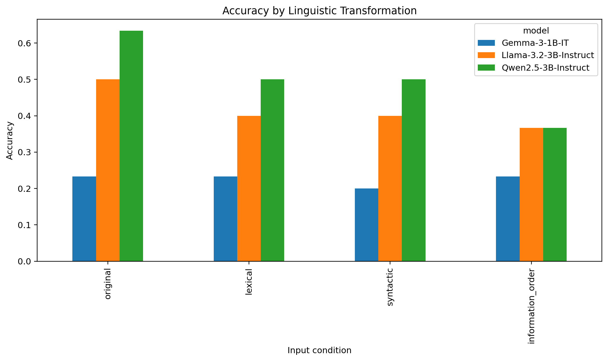
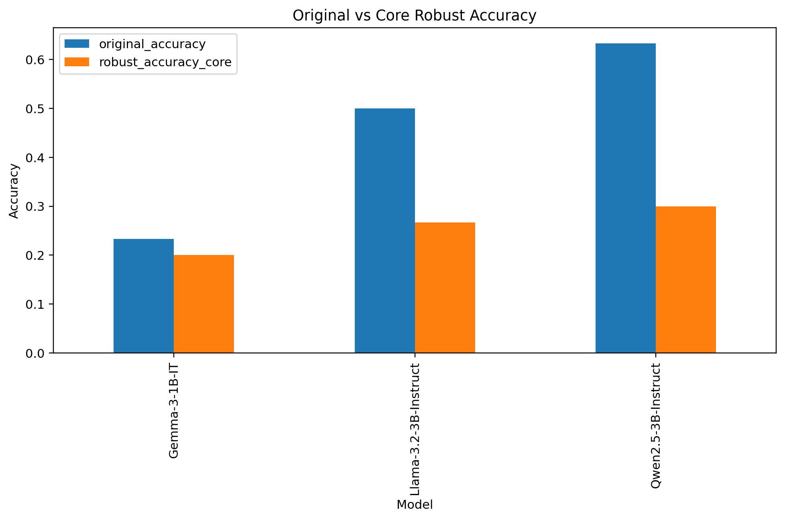
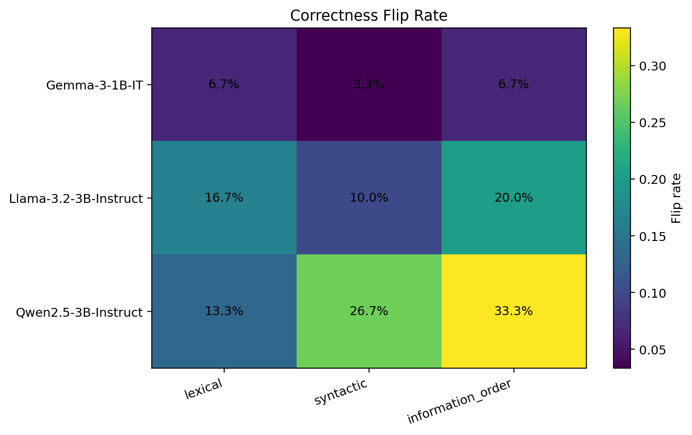

# ReasonShift

## Same Meaning, Different Answer?
### Evaluating Answer Consistency in Large Language Models Across Linguistic Transformations

ReasonShift is an empirical NLP study investigating **answer consistency in small open-weight instruction-tuned language models**. It examines whether a model that correctly solves a reasoning problem continues to answer correctly when the same problem is expressed through different wording, sentence structures, or information order while preserving its intended meaning and correct answer.

The study evaluates **Qwen2.5-3B-Instruct, Llama-3.2-3B-Instruct, and Gemma-3-1B-IT** across **CommonsenseQA, GSM8K, and LogiQA**, covering commonsense, mathematical, and logical reasoning. Each original question is paired with three controlled linguistic reformulations: lexical, syntactic, and information order. The final experiment comprises **30 original question groups, 90 transformations, 120 inputs per model, and 360 total model responses**.

Beyond standard benchmark accuracy, ReasonShift measures **transformation-specific accuracy changes, paired correctness flips, and strict robust accuracy** to investigate whether originally correct answers remain correct across equivalent formulations. Consistency is evaluated through answer correctness rather than identical generated answer text.

---

## Research Poster and Supporting Appendix

This repository accompanies my NLP research project at Universität Trier.

The poster presents the research questions, experimental design, main findings, and conclusions. The supporting appendix provides further methodological details, experimental results, statistical analysis, references, and limitations.

**Project documents**

- [Research Poster](docs/ReasonShift_Poster.pdf)
- [Supporting Research Appendix](docs/ReasonShift_Research_Appendix.pdf)


The repository also contains the experimental dataset, transformation guidelines, validation records, model outputs, evaluation scripts, statistical results, and visualizations used in this study.
# 2. Research Questions

The primary research question is:

> **Do small open-weight instruction-tuned LLMs maintain answer correctness when the same reasoning problem is expressed through different meaning-preserving linguistic formulations?**

The study addresses this question through three research questions:

1. **RQ1 — Performance Change:** How does model accuracy change under lexical, syntactic, and information-order reformulations?
2. **RQ2 — Correctness Stability:** How often do answers change from correct to incorrect, or vice versa, after reformulation?
3. **RQ3 — Robust Accuracy:** How often do models answer correctly across all four formulations, compared with their original accuracy?

Together, these questions examine whether conventional accuracy on a single question formulation provides an incomplete picture of model reliability. The paired experimental design enables the study to distinguish overall accuracy changes from individual correctness transitions and sustained correctness across all four formulations.

---


# 3. Hypothesis

The study tests the following hypothesis:

> **Meaning-preserving reformulations can change model correctness despite an unchanged correct answer. The magnitude of these changes is expected to vary across transformation types.**

The hypothesis assumes that a model should ideally maintain correct answers when the same underlying reasoning problem is presented through different linguistic formulations. However, changes in wording, sentence structure, or information order may influence the model's predictions even when the intended meaning and correct answer remain unchanged.

ReasonShift evaluates this hypothesis by comparing each original question with its lexical, syntactic, and information-order reformulations. Transformation-specific accuracy changes and correctness flips measure how performance varies, while strict robust accuracy identifies question groups answered correctly across all four formulations. These measures help determine whether accuracy on a single formulation conceals variation in model correctness.

---


# 4. Experimental Overview

The final ReasonShift experiment evaluates 30 original reasoning questions across three datasets. Each question is presented in four formulations—Original, Lexical, Syntactic, and Information Order—and evaluated using three open-weight instruction-tuned language models.

| Component | Final Experiment |
|---|---:|
| Original question groups | 30 |
| CommonsenseQA groups | 10 |
| GSM8K groups | 10 |
| LogiQA groups | 10 |
| Linguistic transformations | 90 |
| Formulations per group | 4 |
| Inputs per model | 120 |
| Models | 3 |
| **Total model responses** | **360** |

Each question group contains one original benchmark question and three reformulations designed to preserve its intended meaning, reasoning requirements, and correct answer. The paired design allows model correctness to be compared across different linguistic formulations of the same underlying problem.

**Experimental scale:** `30 groups × 4 formulations = 120 inputs per model`, resulting in `120 inputs × 3 models = 360 total responses`.

---


# 5. Methodology

ReasonShift uses a paired experimental design in which each original reasoning question is compared with three linguistic reformulations. All four formulations are evaluated on the same model under identical inference settings, enabling within-question comparisons of accuracy and correctness changes. This design controls for differences between unrelated benchmark items and helps examine how model performance varies when the linguistic formulation changes.

### 5.1 Datasets

The experiment uses 30 original questions drawn equally from three established reasoning benchmarks. CommonsenseQA evaluates commonsense multiple-choice reasoning, GSM8K evaluates mathematical word-problem reasoning, and LogiQA evaluates logical and deductive reasoning. These datasets were selected to examine correctness stability across distinct reasoning tasks rather than a single benchmark domain.

| Dataset | Reasoning Focus | Groups | Inputs per Model |
|---|---|---:|---:|
| **CommonsenseQA** | Commonsense multiple-choice reasoning | 10 | 40 |
| **GSM8K** | Mathematical word-problem reasoning | 10 | 40 |
| **LogiQA** | Logical and deductive reasoning | 10 | 40 |
| **Total** | — | **30** | **120** |

Each original question is associated with three reformulations: Lexical, Syntactic, and Information Order. The transformations are designed to preserve the intended meaning, reasoning requirements, and correct answer, producing four formulations per question group.

The final experimental dataset is available at [`data/validated/reasonshift_dataset.csv`](data/validated/reasonshift_dataset.csv), with its corresponding manifest stored at [`data/validated/reasonshift_dataset_manifest.txt`](data/validated/reasonshift_dataset_manifest.txt).

### 5.2 Transformation Quality Control

Meaning preservation is essential to the validity of the experiment. A transformation that changes the correct answer, removes necessary information, introduces new facts, or leaks the answer may produce correctness changes that cannot reliably be attributed to linguistic reformulation.

All 90 transformations passed automated structural checks for answer-choice preservation, number preservation where applicable, and actual text change. A stratified sample of 45 transformations was additionally reviewed manually for semantic equivalence, answer preservation, transformation-type validity, fluency, and answer leakage.

| Human-Audit Measure | Result |
|---|---:|
| Transformations audited | 45 |
| Reviewed | 45/45 |
| Accepted | 45/45 |
| Acceptance rate | **100%** |

All 45 manually reviewed transformations were accepted. However, the remaining 45 transformations underwent structural checks without independent manual semantic validation. This limitation is considered when interpreting the experimental findings.

The complete validation records and transformation guidelines are available in the following repository files:

| File | Purpose |
|---|---|
| [`audit/human_audit_45.csv`](audit/human_audit_45.csv) | Manual review of 45 transformations |
| [`audit/automated_structural_checks.csv`](audit/automated_structural_checks.csv) | Automated structural validation results |
| [`audit/final_audit_acceptance_summary.csv`](audit/final_audit_acceptance_summary.csv) | Summary of manual audit acceptance |
| [`audit/FINAL_AUDIT_STATUS.json`](audit/FINAL_AUDIT_STATUS.json) | Final audit status |
| [`annotations/transformation_guidelines.md`](annotations/transformation_guidelines.md) | Transformation and validation criteria |

### 5.3 Models and Inference

Three open-weight instruction-tuned language models from distinct model families were evaluated. The selected models enable a comparison of correctness stability across Qwen, Llama, and Gemma at approximately the 1B–3B parameter scale.

| Model | Hugging Face Checkpoint |
|---|---|
| Qwen2.5-3B-Instruct | `Qwen/Qwen2.5-3B-Instruct` |
| Llama-3.2-3B-Instruct | `meta-llama/Llama-3.2-3B-Instruct` |
| Gemma-3-1B-IT | `google/gemma-3-1b-it` |

Each model received the same 120 inputs using deterministic decoding with `do_sample=False` and `max_new_tokens=32`. The model configuration additionally specifies `trust_remote_code=False`. Disabling sampling reduces one source of output variation, allowing correctness changes to be examined in relation to differences in input formulation. Only final answers were scored, ensuring that the evaluation measures answer correctness rather than the quality or similarity of generated reasoning explanations.

The experiment produced 120 model-response records per model, resulting in 360 total responses. Raw generations are retained in [`outputs/generations/`](outputs/generations/), parsed predictions in [`outputs/parsed/`](outputs/parsed/), and model configurations in [`configs/models.json`](configs/models.json). These artifacts allow the reported predictions and evaluation results to be traced back to the corresponding model outputs.

---

# 6. Linguistic Transformations

Each original question is assigned a `group_id` and paired with three controlled linguistic reformulations: Lexical, Syntactic, and Information Order. These transformations are designed to preserve the original question's intended meaning, reasoning requirements, and correct answer while modifying different aspects of its linguistic presentation.

The four experimental conditions are:

| Condition | Description |
|---|---|
| **Original** | Unmodified benchmark question |
| **Lexical** | Changes words or phrases while preserving meaning |
| **Syntactic** | Changes grammatical or sentence structure |
| **Information Order** | Rearranges existing facts without changing their content |

## 6.1 Original Formulation

The original benchmark question serves as the reference formulation against which the three transformed versions are compared. Its original wording, relevant information, and correct answer are retained.

## 6.2 Lexical Transformation

Lexical transformations modify words or phrases using contextually appropriate alternatives while preserving the intended meaning and correct answer. These changes may involve synonym substitution, phrase-level paraphrasing, or alternative wording without altering the underlying reasoning task.

This condition examines whether model correctness changes when the same problem is expressed using different vocabulary or phrasing.

## 6.3 Syntactic Transformation

Syntactic transformations modify the grammatical structure of a question while preserving its semantic content, relevant facts, and reasoning requirements. These changes may involve restructuring clauses, reorganizing sentences, or changing grammatical constructions without introducing or removing essential information.

This condition examines whether model correctness is sensitive to how the same information is grammatically organized.

## 6.4 Information-Order Transformation

Information-order transformations rearrange the sequence in which existing facts, conditions, or constraints are presented while preserving their content and the correct answer. Unlike lexical and syntactic transformations, this condition primarily changes the presentation order of the information required to solve the problem.

This condition examines whether model correctness changes when the same information is presented in a different sequence.

All transformations are designed to preserve the underlying task. The validation procedure described in Section 5.2 evaluates whether the reformulations satisfy the intended transformation and meaning-preservation criteria.

---


# 7. Evaluation Metrics

ReasonShift evaluates model performance using conventional accuracy and paired correctness-based measures. All predictions are assessed against the original benchmark's correct answer, which is intended to remain unchanged across the four formulations of each question.

Consistency is measured through answer correctness rather than identical generated answer text. This distinction is important because a model may produce different incorrect answers without changing its correctness state.

## 7.1 Accuracy

Accuracy measures the proportion of model predictions that match the correct answer.

`Accuracy = Number of correct predictions / Total evaluated predictions`

Accuracy is calculated overall, by model, by dataset, and by linguistic condition. Each model processes 120 inputs, comprising 30 original questions and 90 transformed versions. Condition-specific accuracy is calculated using the 30 questions evaluated under each formulation.

Overall accuracy provides a summary of model performance, but it does not indicate whether the same individual questions remain correctly answered after reformulation.

## 7.2 Accuracy Change

Accuracy change measures the difference between a model's accuracy on a transformed formulation and its accuracy on the corresponding original questions.

`Accuracy Change(t) = Accuracy(t) - Accuracy(Original)`

The difference is reported in percentage points (pp). A negative value indicates lower accuracy after reformulation, while a positive value indicates improved accuracy.

For example, Qwen's accuracy decreased from 63.3% on original questions to 36.7% under Information Order, corresponding to an accuracy change of approximately −26.7 percentage points, calculated from the underlying counts.

## 7.3 Correctness Flip Rate

Correctness Flip Rate measures the proportion of paired questions whose correctness state changes between the original and transformed formulations.

Two types of correctness transitions are considered:

| Transition | Interpretation |
|---|---|
| Correct → Wrong (C→W) | A previously correct answer becomes incorrect after reformulation |
| Wrong → Correct (W→C) | A previously incorrect answer becomes correct after reformulation |

`Flip Rate = (C→W + W→C) / Total paired questions`

For each model and transformation type, the flip rate is calculated across 30 paired questions.

Correct-to-wrong transitions are also reported as degradations, while wrong-to-correct transitions are reported as recoveries. These directional counts help explain whether reformulation produces a net loss or gain in correct predictions.

Unlike aggregate accuracy, the flip rate captures individual correctness changes even when improvements and degradations partially cancel each other out.

## 7.4 Robust Accuracy

ReasonShift uses a strict group-level robust accuracy criterion. A question group is considered robustly correct only when the model answers the original question and all three transformed formulations correctly.

The four required conditions are:

| Formulation | Required Result |
|---|---|
| Original | Correct |
| Lexical | Correct |
| Syntactic | Correct |
| Information Order | Correct |

`Robust Accuracy = Question groups correct in all four formulations / Total question groups`

The denominator is 30 question groups per model.

Robust accuracy is stricter than ordinary original-question accuracy because a group fails the criterion if any of its four formulations is answered incorrectly.

This measure directly addresses RQ3 by examining how much original-question correctness is retained across all four formulations. It complements transformation-specific accuracy and correctness flip rates by identifying questions for which correct performance is maintained throughout the complete evaluation.

---


# 8. Statistical Analysis

ReasonShift uses paired statistical analysis because each transformed question is directly associated with its original formulation. This design allows correctness changes to be evaluated within the same question group rather than comparing unrelated benchmark items. Statistical analysis combines exact McNemar tests, question-group bootstrap confidence intervals, and Benjamini–Hochberg correction for multiple comparisons.

## 8.1 Exact McNemar Test

The exact McNemar test evaluates whether the number of correct-to-wrong transitions differs from the number of wrong-to-correct transitions between the original and transformed formulations.

For each model and transformation type, the analysis considers two discordant outcomes:

| Transition | Interpretation |
|---|---|
| Correct → Wrong (C→W) | The original answer was correct, but the transformed answer was incorrect |
| Wrong → Correct (W→C) | The original answer was incorrect, but the transformed answer was correct |

Concordant pairs, where both answers are correct or both are incorrect, do not contribute to the McNemar test statistic.

The exact test is appropriate for the relatively small number of paired questions in this experiment because it does not rely on the large-sample chi-square approximation.

For example, Qwen2.5-3B-Instruct under Information Order produced 9 correct-to-wrong transitions and 1 wrong-to-correct transition across 30 paired questions. The corresponding two-sided exact McNemar test yielded an unadjusted p-value of approximately 0.0215.

The test evaluates whether the observed directional imbalance in correctness transitions is compatible with the null hypothesis of equal probabilities of correct-to-wrong and wrong-to-correct transitions. A small p-value indicates evidence against that null hypothesis before accounting for multiple comparisons.

## 8.2 Bootstrap Confidence Intervals

Question-group bootstrap resampling is used to estimate 95% confidence intervals (CIs) for accuracy differences between original and transformed formulations.

The question group is the resampling unit because the original question and its three transformations belong to the same underlying reasoning problem. Resampling complete groups preserves this paired relationship when estimating uncertainty.

For each bootstrap sample, the accuracy difference is calculated as:

`Accuracy Change = Transformed Accuracy - Original Accuracy`

The resulting bootstrap distribution provides an estimate of uncertainty around the observed accuracy difference.

These confidence intervals complement the McNemar tests by describing the uncertainty associated with the magnitude of the observed accuracy changes, rather than relying only on statistical significance.

## 8.3 Multiple-Testing Correction

ReasonShift performs multiple paired comparisons across models, datasets, and linguistic transformation types. Conducting several statistical tests increases the risk of obtaining small p-values by chance.

The Benjamini–Hochberg (BH) procedure is therefore applied to the McNemar p-values to control the false discovery rate across the specified family of comparisons.

Both the unadjusted and BH-adjusted p-values are retained in the statistical results:

| Output Field | Description |
|---|---|
| `mcnemar_p` | Unadjusted exact McNemar p-value |
| `mcnemar_p_bh` | Benjamini–Hochberg-adjusted p-value |

Statistical significance after correction is evaluated at a threshold of `α = 0.05`.

## 8.4 Statistical Interpretation

For Qwen2.5-3B-Instruct under Information Order, the reported statistical results are:

| Measure | Result |
|---|---:|
| Original accuracy | 63.3% |
| Information Order accuracy | 36.7% |
| Accuracy change | −26.7 pp |
| Correct → Wrong | 9 |
| Wrong → Correct | 1 |
| Correctness flip rate | 33.3% |
| Exact McNemar p-value | 0.021484 |
| BH-adjusted p-value | 0.773438 |

Although the unadjusted McNemar p-value is below 0.05, the comparison does not remain statistically significant after Benjamini–Hochberg correction. No tested comparison in the final reported analysis remained significant at the corrected threshold.

The observed accuracy differences and correctness transitions therefore provide descriptive evidence of instability within the evaluated questions, but they should not be interpreted as conclusive evidence of statistically significant transformation effects across the broader population of reasoning problems or language models.

The study emphasizes observed effect sizes, paired correctness transitions, and robust accuracy while acknowledging the limited statistical power of the 30-question benchmark.

The statistical analysis is implemented in [`src/analyze_results.py`](src/analyze_results.py), with paired results available in [`results/paired_robustness_results.csv`](results/paired_robustness_results.csv) and additional summaries in [`results/`](results/).

---


# 9. Results

This section presents the empirical findings of ReasonShift across three open-weight instruction-tuned language models, three reasoning datasets, and four linguistic formulations. The analysis examines overall model accuracy, transformation-specific performance changes, correctness flips, and strict robust accuracy. Results are interpreted in relation to the three research questions, with statistical uncertainty and limitations considered separately.

## 9.1 Overall Model Accuracy

Overall accuracy measures the proportion of correct predictions across all 120 inputs evaluated for each model, combining the original questions with their lexical, syntactic, and information-order reformulations. Since each model receives the same 30 question groups and four formulations per group, this measure provides a common basis for describing performance across the complete evaluation set.

The final experiment produced the following results:

| Model | Correct Predictions | Total Inputs | Overall Accuracy |
|---|---:|---:|---:|
| **Qwen2.5-3B-Instruct** | 60 | 120 | **50.0%** |
| **Llama-3.2-3B-Instruct** | 50 | 120 | **41.7%** |
| **Gemma-3-1B-IT** | 27 | 120 | **22.5%** |

Qwen2.5-3B-Instruct answered 60 of the 120 inputs correctly, corresponding to an overall accuracy of 50.0%. Llama-3.2-3B-Instruct answered 50 inputs correctly, achieving 41.7%, while Gemma-3-1B-IT answered 27 inputs correctly, achieving 22.5%. These results describe the performance of the three evaluated models on the specific ReasonShift benchmark and should not be interpreted as a general comparison of their capabilities across all NLP tasks.

However, overall accuracy alone cannot establish whether a model answers the same underlying questions correctly across different formulations. A model may achieve a similar aggregate accuracy across two conditions while answering different individual questions correctly in each condition. Correct-to-wrong and wrong-to-correct transitions may also partially offset one another, concealing changes in individual predictions.

For this reason, ReasonShift evaluates overall accuracy alongside transformation-specific accuracy, paired correctness flips, and strict robust accuracy. The following subsections examine how performance varies when the linguistic formulation changes while the underlying reasoning problem is intended to remain unchanged.


## 9.2 Accuracy by Linguistic Transformation

This analysis examines how model accuracy varies across the four experimental conditions: Original, Lexical, Syntactic, and Information Order. Each condition contains 30 questions per model, with 10 questions from each reasoning dataset. The original formulation serves as the reference against which the three transformed conditions are compared.

The following table presents the accuracy of each model under the four linguistic formulations.

| Model | Original | Lexical | Syntactic | Information Order |
|---|---:|---:|---:|---:|
| **Qwen2.5-3B-Instruct** | **63.3%** | 50.0% | 50.0% | **36.7%** |
| **Llama-3.2-3B-Instruct** | **50.0%** | 40.0% | 40.0% | **36.7%** |
| **Gemma-3-1B-IT** | **23.3%** | 23.3% | 20.0% | 23.3% |



### 9.2.1 Qwen2.5-3B-Instruct

Qwen achieved 63.3% accuracy on the original questions, correctly answering 19 of the 30 inputs. Accuracy decreased to 50.0% under both Lexical and Syntactic transformations, corresponding to 15 correct answers in each condition. Information Order produced the largest observed decrease for Qwen, with accuracy falling to 36.7%, corresponding to 11 correct answers.

The transformation-specific accuracy changes relative to the original formulation were:

| Transformation | Accuracy Change |
|---|---:|
| Lexical | −13.3 pp |
| Syntactic | −13.3 pp |
| Information Order | **−26.7 pp** |

The Information Order result indicates that Qwen answered eight fewer questions correctly when the same underlying problems were presented with rearranged information. This was the largest descriptive accuracy decrease observed for Qwen across the three transformation types.

### 9.2.2 Llama-3.2-3B-Instruct

Llama achieved 50.0% accuracy on the original questions, correctly answering 15 of the 30 inputs. Accuracy decreased to 40.0% under both Lexical and Syntactic transformations, while Information Order produced an accuracy of 36.7%.

The transformation-specific accuracy changes relative to the original formulation were:

| Transformation | Accuracy Change |
|---|---:|
| Lexical | −10.0 pp |
| Syntactic | −10.0 pp |
| Information Order | **−13.3 pp** |

Llama showed lower accuracy under all three transformed conditions compared with its original formulation. Information Order produced the largest descriptive decrease for this model, although the difference between transformation types was smaller than that observed for Qwen.

### 9.2.3 Gemma-3-1B-IT

Gemma achieved 23.3% accuracy on the original questions. Accuracy remained at 23.3% under Lexical and Information Order transformations, while Syntactic transformation produced a slight decrease to 20.0%.

The transformation-specific accuracy changes relative to the original formulation were:

| Transformation | Accuracy Change |
|---|---:|
| Lexical | 0.0 pp |
| Syntactic | −3.3 pp |
| Information Order | 0.0 pp |

Gemma's aggregate accuracy changed relatively little across the four formulations. However, its original accuracy was already substantially lower than that of Qwen and Llama. A small accuracy difference therefore should not be interpreted as evidence of greater overall reliability or stronger answer consistency.

Moreover, unchanged aggregate accuracy does not necessarily imply unchanged correctness for individual questions. Correct-to-wrong and wrong-to-correct transitions can offset each other, producing the same total accuracy despite changes in which questions are answered correctly.

### 9.2.4 Interpretation

The results provide descriptive evidence that model accuracy can vary when the linguistic formulation changes while the underlying question is intended to remain equivalent.

Information Order produced the largest observed accuracy decrease for both Qwen and Llama, whereas Gemma showed comparatively small changes across the evaluated formulations. These patterns suggest that the relationship between linguistic formulation and answer correctness differs across the evaluated models.

However, transformation-specific accuracy alone does not reveal whether the same individual questions remain correctly answered. For example, two formulations can have identical accuracy even when some originally correct answers become incorrect and other originally incorrect answers become correct.

This motivates the paired correctness analysis presented in the following subsections, which examines individual correctness transitions and strict robust accuracy across all four formulations.

The observed differences are descriptive and should not be interpreted as statistically established transformation effects, as no tested comparison remained significant after multiple-testing correction.


## 9.3 Original Accuracy vs. Robust Accuracy

Original accuracy measures how often a model correctly answers the 30 unmodified benchmark questions. However, correctly answering a question in its original formulation does not establish that the model will remain correct when the same problem is expressed through different linguistic formulations.

ReasonShift therefore evaluates strict robust accuracy, defined as the percentage of question groups for which the model answers all four formulations correctly: Original, Lexical, Syntactic, and Information Order. A question group is considered robustly correct only when every formulation receives the correct answer. If even one formulation is answered incorrectly, the group does not satisfy this criterion.

The following table compares original accuracy with strict robust accuracy across the three evaluated models.

| Model | Original Accuracy | Robust Accuracy | Robustness Gap |
|---|---:|---:|---:|
| **Qwen2.5-3B-Instruct** | **63.3%** | **30.0%** | **−33.3 pp** |
| **Llama-3.2-3B-Instruct** | **50.0%** | **26.7%** | **−23.3 pp** |
| **Gemma-3-1B-IT** | **23.3%** | **20.0%** | **−3.3 pp** |



### 9.3.1 Qwen2.5-3B-Instruct

Qwen correctly answered 19 of the 30 original questions, achieving an original accuracy of 63.3%. However, only 9 of the 30 question groups were answered correctly across all four formulations, resulting in a strict robust accuracy of 30.0%.

This corresponds to an original-to-robust accuracy gap of 33.3 percentage points. In other words, 10 question groups that were answered correctly in their original formulation failed to maintain correct performance across all three reformulations.

This finding illustrates how original-question accuracy can provide an incomplete picture of correctness stability. A model may correctly solve a reasoning problem when presented in one form but fail to maintain that correctness when the same underlying problem is reformulated.

### 9.3.2 Llama-3.2-3B-Instruct

Llama achieved 50.0% original accuracy, correctly answering 15 of the 30 original questions. Strict robust accuracy decreased to 26.7%, corresponding to 8 question groups answered correctly across all four formulations.

The original-to-robust accuracy gap was 23.3 percentage points. Seven question groups that were originally answered correctly failed the strict robustness criterion because at least one transformed formulation was answered incorrectly.

This demonstrates that correctness variation across formulations was not limited to Qwen. Llama also showed a substantial descriptive difference between performance on original questions and sustained correctness across all four formulations.

### 9.3.3 Gemma-3-1B-IT

Gemma achieved 23.3% original accuracy, correctly answering 7 of the 30 original questions. Strict robust accuracy was 20.0%, corresponding to 6 question groups answered correctly across all four formulations.

The original-to-robust accuracy gap was 3.3 percentage points, equivalent to one originally correct question group failing the strict robustness criterion.

Although Gemma showed a smaller absolute gap than Qwen and Llama, this does not establish greater overall reliability. Its original accuracy was already substantially lower, leaving fewer originally correct question groups that could fail the robustness criterion.

Robust accuracy should therefore be interpreted alongside original accuracy rather than using the absolute gap alone to compare model reliability.

### 9.3.4 Interpretation

All three evaluated models showed lower strict robust accuracy than original accuracy. This is expected from the metric's definition: a question group can only be robustly correct if its original formulation is also answered correctly.

The more informative finding is the magnitude of the difference between the two measures. Qwen showed an original-to-robust gap of 33.3 percentage points, Llama showed a gap of 23.3 percentage points, and Gemma showed a gap of 3.3 percentage points.

These results demonstrate that evaluating only the original formulation can overlook failures to maintain correct answers across alternative formulations of the same question. Strict robust accuracy complements conventional benchmark accuracy by requiring correct performance across the complete question group rather than a single presentation of the underlying problem.

Importantly, the robustness gap is not the accuracy decrease caused by an individual transformation. It measures the difference between original-question accuracy and the proportion of groups answered correctly across all four formulations.

This analysis directly addresses **RQ3 — Robust Accuracy**, showing how much originally correct performance is maintained across the complete set of linguistic reformulations. The findings are descriptive and apply to the evaluated 30-question benchmark; broader generalization requires larger, more extensively validated experiments.


## 9.4 Correctness Flip Rates

Transformation-specific accuracy describes the total proportion of correct answers under each condition, but it does not reveal whether the same individual questions remain correctly answered. ReasonShift therefore uses correctness flip rates to measure how often a model's correctness state changes between an original question and its transformed counterpart.

A correctness flip occurs in either direction: **Correct → Wrong (C→W)** or **Wrong → Correct (W→C)**. The flip rate includes both transitions and is calculated across the 30 paired questions for each model and transformation type.

| Model | Lexical | Syntactic | Information Order |
|---|---:|---:|---:|
| **Qwen2.5-3B-Instruct** | 13.3% | 26.7% | **33.3%** |
| **Llama-3.2-3B-Instruct** | 16.7% | 10.0% | 20.0% |
| **Gemma-3-1B-IT** | 6.7% | 3.3% | 6.7% |



### 9.4.1 Qwen2.5-3B-Instruct

Qwen showed correctness flip rates of 13.3% under Lexical, 26.7% under Syntactic, and 33.3% under Information Order transformations. These percentages correspond to 4, 8, and 10 of the 30 paired questions changing correctness state, respectively.

Information Order produced the largest observed flip rate for Qwen. Of the 10 questions that changed correctness state, 9 shifted from correct to wrong and 1 shifted from wrong to correct. This resulted in a net loss of 8 correct answers, consistent with the decrease from 19 correct original answers to 11 correct Information Order answers.

The distinction between **33.3% flip rate** and **−26.7 percentage-point accuracy change** is important. The flip rate counts all 10 questions whose correctness state changed, regardless of direction. The accuracy change reflects the net effect of 9 degradations and 1 recovery.

### 9.4.2 Llama-3.2-3B-Instruct

Llama showed correctness flip rates of 16.7% under Lexical, 10.0% under Syntactic, and 20.0% under Information Order transformations. These correspond to 5, 3, and 6 paired questions changing correctness state, respectively.

As with Qwen, Information Order produced Llama's largest observed flip rate. However, the pattern was not identical across the other transformations: Llama showed more flips under Lexical than Syntactic reformulation, whereas Qwen showed more flips under Syntactic than Lexical reformulation.

### 9.4.3 Gemma-3-1B-IT

Gemma showed correctness flip rates of 6.7% under Lexical, 3.3% under Syntactic, and 6.7% under Information Order transformations. These correspond to 2, 1, and 2 paired questions changing correctness state, respectively.

Notably, Gemma's accuracy remained at 23.3% under both Original and Lexical formulations, despite two correctness flips. One originally correct answer became incorrect, while one originally incorrect answer became correct. The two transitions cancelled out in the aggregate accuracy calculation.

The same pattern occurred under Information Order. These results illustrate why unchanged accuracy should not be interpreted as unchanged correctness for individual questions.

### 9.4.4 Interpretation

The paired analysis shows that all three evaluated models exhibited correctness changes after linguistic reformulation. Information Order produced the largest observed flip rate for both Qwen and Llama, while Gemma showed fewer flips in absolute terms alongside substantially lower original accuracy.

Correctness flip rates complement transformation-specific accuracy by distinguishing **changes in which questions are answered correctly** from **changes in the total number of correct answers**. This directly addresses RQ2 and motivates the directional transition analysis in Section 9.5.

These findings describe the evaluated question pairs. They should not be interpreted as statistically established differences between transformation types, as no tested comparison remained significant after multiple-testing correction.


## 9.5 Paired Transition Analysis

Correctness flip rates measure how often a prediction changes correctness state, but they do not indicate whether those changes primarily represent losses or gains in correct answers. ReasonShift therefore examines the direction of each paired transition between the original question and its transformed counterpart.

A **Correct → Wrong (C→W)** transition occurs when a model answers the original question correctly but fails on its reformulation. A **Wrong → Correct (W→C)** transition occurs when a model answers the original question incorrectly but succeeds on its reformulation. For each model and transformation type, these counts are calculated over the same 30 paired question groups.

| Model | Transformation | C→W | W→C | Flip Rate | Accuracy Change |
|---|---|---:|---:|---:|---:|
| **Qwen** | Lexical | 4 | 0 | 13.3% | −13.3 pp |
| **Qwen** | Syntactic | 6 | 2 | 26.7% | −13.3 pp |
| **Qwen** | Information Order | **9** | **1** | **33.3%** | **−26.7 pp** |
| **Llama** | Lexical | 4 | 1 | 16.7% | −10.0 pp |
| **Llama** | Syntactic | 3 | 0 | 10.0% | −10.0 pp |
| **Llama** | Information Order | 5 | 1 | 20.0% | −13.3 pp |
| **Gemma** | Lexical | 1 | 1 | 6.7% | 0.0 pp |
| **Gemma** | Syntactic | 1 | 0 | 3.3% | −3.3 pp |
| **Gemma** | Information Order | 1 | 1 | 6.7% | 0.0 pp |

### 9.5.1 Degradations and Recoveries

Correct-to-wrong transitions represent **degradations**: cases in which the model initially solved the question but failed after reformulation. Wrong-to-correct transitions represent **recoveries**: cases in which reformulation resulted in a correct answer to a question the model originally answered incorrectly.

The two directions affect aggregate accuracy differently. Degradations reduce the number of correct answers, whereas recoveries increase it. Consequently, the net accuracy change depends on the difference between recoveries and degradations, while the flip rate depends on their sum.

`Net change in correct answers = W→C − C→W`

`Flip count = C→W + W→C`

These measures provide complementary views of correctness stability.

### 9.5.2 Qwen: Information-Order Reformulation

Qwen under Information Order produced the largest observed number of paired correctness transitions in the final experiment. Across 30 question pairs, 9 originally correct answers became incorrect, while 1 originally incorrect answer became correct.

The 10 transitions correspond to a correctness flip rate of 33.3%. Because degradations exceeded recoveries by 8, the number of correct predictions decreased from 19 on the original questions to 11 under Information Order, producing an accuracy change of approximately −26.7 percentage points.

This result demonstrates why a flip rate and an accuracy change should not be interpreted as interchangeable measures. The flip rate captures all 10 changed correctness states, while the accuracy change captures their net effect.

### 9.5.3 Similar Accuracy Changes Can Conceal Different Transitions

Qwen's Lexical and Syntactic transformations both produced an accuracy decrease of approximately 13.3 percentage points, but their paired transition patterns differed.

Under Lexical reformulation, 4 correct answers became incorrect and no incorrect answers became correct, producing 4 total flips. Under Syntactic reformulation, 6 correct answers became incorrect while 2 incorrect answers became correct, producing 8 total flips.

Although the two conditions had the same aggregate accuracy of 50.0%, the Syntactic condition changed the correctness state of twice as many individual question pairs.

Gemma illustrates a related pattern. Under both Lexical and Information Order reformulation, one answer changed from correct to wrong and another changed from wrong to correct. Its aggregate accuracy therefore remained unchanged, despite two correctness flips under each condition.

These examples show that equal or unchanged accuracy does not imply that the same questions were answered correctly.

### 9.5.4 Interpretation

The paired transition results show that linguistic reformulation can be associated with both losses and gains in correct answers. Across the evaluated conditions, degradations and recoveries did not always occur in equal numbers, producing the accuracy changes reported in Section 9.2.

This analysis directly addresses **RQ2 — Correctness Stability** by identifying not only how often correctness changes, but also whether those changes represent degradations or recoveries. Together with the flip-rate analysis, it provides a more detailed account of model behavior than aggregate accuracy alone.

The observed transition counts are descriptive results from the 30-question benchmark. Their statistical interpretation, including exact McNemar tests and multiple-testing correction, is presented in the following subsection.


## 9.6 Statistical Results

The descriptive results show changes in model correctness across linguistic formulations. To assess the statistical evidence for these changes, ReasonShift applies exact McNemar tests to paired correctness outcomes, estimates uncertainty using question-group bootstrap confidence intervals, and applies Benjamini–Hochberg correction for multiple comparisons, as described in Section 8.

### 9.6.1 Qwen Under Information-Order Reformulation

The largest observed accuracy decrease and correctness flip rate occurred for Qwen2.5-3B-Instruct under Information Order. The paired comparison produced the following results:

| Measure | Result |
|---|---:|
| Original accuracy | 63.3% |
| Information Order accuracy | 36.7% |
| Accuracy change | −26.7 pp |
| Correct → Wrong | 9 |
| Wrong → Correct | 1 |
| Correctness flip rate | 33.3% |
| Exact McNemar p-value | 0.021484 |
| BH-adjusted p-value | 0.773438 |

Qwen answered 19 of the 30 original questions correctly but only 11 of their Information Order reformulations correctly. Nine originally correct answers became incorrect, while one originally incorrect answer became correct, resulting in a net loss of eight correct predictions.

The two-sided exact McNemar test produced an unadjusted p-value of approximately 0.0215. However, the Benjamini–Hochberg-adjusted p-value was approximately 0.7734, which exceeds the significance threshold of `α = 0.05`. The comparison therefore did not remain statistically significant after multiple-testing correction.

The observed decrease of approximately 26.7 percentage points and the 33.3% correctness flip rate remain descriptive findings for the evaluated question pairs. They should not be presented as a statistically established effect of information-order reformulation across a broader population of questions.

### 9.6.2 Findings Across the Paired Comparisons

No tested transformation effect in the final reported analysis remained statistically significant at `α = 0.05` after Benjamini–Hochberg correction.

This does not mean that no correctness changes occurred. The paired records document correct-to-wrong and wrong-to-correct transitions within the evaluated benchmark. Rather, the statistical analysis does not provide sufficient evidence to establish the reported transformation effects after accounting for multiple comparisons.

The experiment contains only 30 original question groups, with 10 groups from each reasoning dataset. This limits statistical power and the precision with which transformation effects can be estimated. The results should therefore be interpreted primarily through the observed accuracy changes, paired transition counts, correctness flip rates, and strict robust accuracy, while acknowledging uncertainty and the exploratory scope of the study.

The complete paired statistical results are available in [`results/paired_robustness_results.csv`](results/paired_robustness_results.csv), and the analysis is implemented in [`src/analyze_results.py`](src/analyze_results.py).

---


# 10. Discussion and Limitations

ReasonShift investigated whether small open-weight instruction-tuned language models maintain answer correctness when the same reasoning problem is presented through different linguistic formulations. The results show observable correctness changes within the evaluated benchmark, while the limited sample size and statistical findings require cautious interpretation.

## 10.1 Interpretation of the Main Findings

**Linguistic reformulation was associated with changes in answer correctness.** All three evaluated models exhibited at least some correct-to-wrong or wrong-to-correct transitions. These changes occurred even though the transformations were designed to preserve the underlying reasoning problem and its correct answer. The findings therefore illustrate why evaluating a model on only one formulation may provide an incomplete description of its performance on the selected questions.

**Original accuracy did not capture sustained correctness across all formulations.** Qwen answered 63.3% of original questions correctly, but only 30.0% of question groups correctly across Original, Lexical, Syntactic, and Information Order formulations. Llama showed a corresponding decrease from 50.0% original accuracy to 26.7% strict robust accuracy. These gaps show that some originally correct answers were not maintained throughout the complete question group.

**Information Order produced the largest observed accuracy decrease for Qwen and Llama.** Qwen's accuracy decreased by approximately 26.7 percentage points under Information Order, with 9 correct-to-wrong transitions and 1 wrong-to-correct transition. Llama showed a smaller decrease of approximately 13.3 percentage points under the same condition. These are descriptive patterns within the evaluated sample, not statistically established differences between transformation types.

**Aggregate accuracy concealed some individual correctness changes.** Gemma's accuracy was unchanged under Lexical and Information Order transformations, although each condition contained one degradation and one recovery. Similarly, Qwen's Lexical and Syntactic conditions had identical accuracy but different flip rates. These cases demonstrate the value of paired correctness analysis alongside standard accuracy.

Together, these findings address the three research questions: transformation-specific accuracy describes performance changes (RQ1), paired transitions and flip rates describe correctness stability (RQ2), and strict robust accuracy measures whether correct answers persist across all four formulations (RQ3).

## 10.2 Implications for Evaluation

The results illustrate a limitation of evaluating language models using only a single wording of each benchmark question. Original accuracy reports whether a model answers that formulation correctly, but it does not show whether correctness persists when the same problem is presented differently.

For this reason, ReasonShift combines accuracy changes, paired correctness transitions, and strict robust accuracy. These measures capture distinct aspects of performance: the net change in correct answers, changes in which individual questions are answered correctly, and sustained correctness across the complete question group.

The study evaluates **final-answer correctness consistency**, not identical answer text, the faithfulness of generated explanations, or the models' internal reasoning processes. The observed associations between formulation and correctness should also not be interpreted as establishing the mechanism responsible for a model's prediction.

## 10.3 Limitations

Several limitations constrain the interpretation and generalizability of the findings.

**Small benchmark size.** The final experiment contains 30 original question groups, with 10 groups from each dataset. Although this enables paired comparisons across three reasoning domains, the sample limits statistical power and the precision of estimated transformation effects.

**Limited model coverage.** The study evaluates three relatively small open-weight instruction-tuned models. The findings should not be generalized automatically to larger models, proprietary systems, or other model families.

**Incomplete manual semantic validation.** All 90 transformations passed automated structural checks, but independent manual review covered a stratified sample of 45 transformations. All 45 reviewed items were accepted; however, the other 45 were not independently verified for semantic equivalence through the same manual process. Automated structural checks alone cannot establish that every reformulation fully preserves meaning.

**Restricted transformation scope.** The experiment considers Lexical, Syntactic, and Information Order reformulations. Other meaning-preserving variations, such as changes in discourse structure or more extensive paraphrasing, may produce different results.

**Restricted benchmark scope.** CommonsenseQA, GSM8K, and LogiQA represent selected commonsense, mathematical, and logical reasoning tasks. They do not cover the full range of language understanding or reasoning behavior.

**Statistical uncertainty.** No tested transformation effect remained statistically significant at `α = 0.05` after Benjamini–Hochberg correction. Consequently, the observed differences should be treated as exploratory findings for the evaluated questions rather than conclusive population-level evidence of transformation-specific effects.

## 10.4 Conclusion

ReasonShift shows that original-question accuracy, paired correctness stability, and strict robust accuracy provide different views of model performance. Within this controlled 30-question benchmark, some originally correct answers became incorrect after linguistic reformulation, while some originally incorrect answers became correct.

The study's main contribution is a reproducible paired evaluation that examines **whether answer correctness persists across alternative formulations of the same underlying reasoning problem**. The observed results motivate broader evaluations with more question groups, additional model families, and more extensive semantic validation before drawing general conclusions about language-model robustness.

---


# 11. Reproducibility

ReasonShift retains the validated experimental dataset, transformation guidelines, audit records, model configurations, raw generations, parsed predictions, analysis scripts, statistical results, and figures used to document the final experiment. The repository is organized so that readers can inspect the reported findings and rerun the analysis using the retained outputs without needing to generate a new set of linguistic transformations.

The reproduction steps below describe the documented project workflow. Model inference can be rerun separately if the required model checkpoints and computing resources are available.

## 11.1 Repository Structure

The main repository directories are organized as follows:

```text
ReasonShift/
├── annotations/
│   └── transformation_guidelines.md
├── audit/
│   ├── automated_structural_checks.csv
│   ├── final_audit_acceptance_summary.csv
│   ├── FINAL_AUDIT_STATUS.json
│   └── human_audit_45.csv
├── configs/
│   ├── experiment.json
│   └── models.json
├── data/
│   └── validated/
│       ├── reasonshift_dataset.csv
│       └── reasonshift_dataset_manifest.txt
├── docs/
│   ├── ReasonShift_Poster.pdf
│   └── ReasonShift_Research_Appendix.pdf
├── figures/
│   ├── accuracy_by_transformation.png
│   ├── flip_rate_heatmap.png
│   └── original_vs_robust_accuracy.png
├── outputs/
│   ├── generations/
│   └── parsed/
├── prompts/
│   └── transformations/
├── results/
├── src/
├── README.md
└── requirements.txt
```

The final dataset and its manifest are stored in [`data/validated/`](data/validated/). Transformation instructions are retained in [`prompts/transformations/`](prompts/transformations/), while validation records and guidelines are available in [`audit/`](audit/) and [`annotations/`](annotations/). Raw model responses, parsed predictions, statistical outputs, and figures are retained in their corresponding repository directories.

## 11.2 Environment Setup

Python 3.11 was used during development. The following commands describe how to set up the project environment.

**Clone the repository:**

```bash
git clone <REPOSITORY-URL>
cd ReasonShift
```

Replace `<REPOSITORY-URL>` with the repository's GitHub clone URL.

**Create a virtual environment:**

```bash
python -m venv .venv
```

**Activate the environment on Windows:**

```bat
.venv\Scripts\activate
```

**Alternatively, activate it on Linux or macOS:**

```bash
source .venv/bin/activate
```

**Install the project dependencies:**

```bash
pip install -r requirements.txt
```

**Check the environment:**

```bash
python -m src.check_environment
```

The dependency list is available in [`requirements.txt`](requirements.txt), and the model and experiment settings are recorded in [`configs/models.json`](configs/models.json) and [`configs/experiment.json`](configs/experiment.json).

## 11.3 Reproduce Model Inference

The final experiment evaluates the same 120 inputs using each of the three selected models. The documented inference commands are:

**Qwen2.5-3B-Instruct:**

```bash
python -m src.run_inference --model qwen_2_5_3b
```

**Llama-3.2-3B-Instruct:**

```bash
python -m src.run_inference --model llama_3_2_3b
```

**Gemma-3-1B-IT:**

```bash
python -m src.run_inference --model gemma_3_1b
```

Each run is expected to produce 120 model-response records, resulting in 360 records across the three models. The retained raw generations are available in [`outputs/generations/`](outputs/generations/).

The reported experiment used deterministic decoding with `do_sample=False` and `max_new_tokens=32`, as documented in Section 5.3. Exact model configurations are retained in [`configs/models.json`](configs/models.json).

## 11.4 Parse Model Outputs

The following commands parse the retained model generations into structured prediction files.

**Qwen:**

```bash
python -m src.parse_model_outputs --input outputs/generations/qwen_2_5_3b_outputs.jsonl --output outputs/parsed/qwen_2_5_3b_outputs_parsed.jsonl
```

**Llama:**

```bash
python -m src.parse_model_outputs --input outputs/generations/llama_3_2_3b_outputs.jsonl --output outputs/parsed/llama_3_2_3b_outputs_parsed.jsonl
```

**Gemma:**

```bash
python -m src.parse_model_outputs --input outputs/generations/gemma_3_1b_outputs.jsonl --output outputs/parsed/gemma_3_1b_outputs_parsed.jsonl
```

The documented final run produced 120 response records for each model. Qwen had 120/120 successfully parsed outputs, while the existing experiment documentation records 120 Llama response records and 119/120 successfully parsed Gemma outputs. The handling of the remaining Gemma record should be confirmed against the parser and analysis scripts when verifying the reported accuracy denominator.

## 11.5 Reproduce the Analysis and Figures

The retained parsed outputs can be used to regenerate the reported statistical summaries.

**Run the analysis:**

```bash
python -m src.analyze_results
```

The analysis produces the performance and paired robustness files in [`results/`](results/).

**Generate the figures:**

```bash
python -m src.generate_figures
```

The documented figure outputs are:

```text
figures/accuracy_by_transformation.png
figures/flip_rate_heatmap.png
figures/original_vs_robust_accuracy.png
```

These figures are included in Section 9 alongside the corresponding results tables and interpretations.

## 11.6 Main Result Files

The following files provide direct access to the reported experimental outcomes:

| File | Contents |
|---|---|
| [`results/overall_accuracy_by_model.csv`](results/overall_accuracy_by_model.csv) | Overall accuracy for each model |
| [`results/accuracy_by_model_variant.csv`](results/accuracy_by_model_variant.csv) | Accuracy by model and linguistic condition |
| [`results/accuracy_by_model_dataset_variant.csv`](results/accuracy_by_model_dataset_variant.csv) | Dataset-specific accuracy by model and condition |
| [`results/paired_robustness_results.csv`](results/paired_robustness_results.csv) | Paired correctness statistics and statistical tests |
| [`results/robust_accuracy_results.csv`](results/robust_accuracy_results.csv) | Strict group-level robust accuracy |
| [`results/transition_summary.csv`](results/transition_summary.csv) | Summary of correctness transitions |
| [`results/transition_candidates.csv`](results/transition_candidates.csv) | Individual transition candidates |
| [`audit/human_audit_45.csv`](audit/human_audit_45.csv) | Manual transformation audit |

These artifacts allow the numerical results in Section 9 to be traced to the retained experimental records. Earlier development experiments and pre-final transformation attempts are excluded from the documented final-result set to distinguish them from the data used for the reported findings.

---


# 12. References and Acknowledgments

## 12.1 Research and Benchmark References

The following publications provide the principal research context and introduce the three reasoning benchmarks used in ReasonShift.

1. **Srikanth, N., Carpuat, M., & Rudinger, R. (2024).** [How Often Are Errors in Natural Language Reasoning Due to Paraphrastic Variability?](https://aclanthology.org/2024.tacl-1.63/) *Transactions of the Association for Computational Linguistics, 12*, 1143–1162. https://doi.org/10.1162/tacl_a_00692

2. **Talmor, A., Herzig, J., Lourie, N., & Berant, J. (2019).** [CommonsenseQA: A Question Answering Challenge Targeting Commonsense Knowledge.](https://aclanthology.org/N19-1421/) *Proceedings of NAACL-HLT 2019*, 4149–4158. https://doi.org/10.18653/v1/N19-1421

3. **Cobbe, K., et al. (2021).** [Training Verifiers to Solve Math Word Problems.](https://arxiv.org/abs/2110.14168) *arXiv:2110.14168.* Introduces the GSM8K benchmark.

4. **Liu, J., Cui, L., Liu, H., Huang, D., Wang, Y., & Zhang, Y. (2020).** [LogiQA: A Challenge Dataset for Machine Reading Comprehension with Logical Reasoning.](https://www.ijcai.org/proceedings/2020/501) *Proceedings of IJCAI 2020*, 3622–3628. https://doi.org/10.24963/ijcai.2020/501

## 12.2 Evaluated Model Checkpoints

The experiment uses the following published model checkpoints. Exact inference settings are documented in Section 5.3 and [`configs/models.json`](configs/models.json).

| Model | Model Checkpoint |
|---|---|
| Qwen2.5-3B-Instruct | [`Qwen/Qwen2.5-3B-Instruct`](https://huggingface.co/Qwen/Qwen2.5-3B-Instruct) |
| Llama-3.2-3B-Instruct | [`meta-llama/Llama-3.2-3B-Instruct`](https://huggingface.co/meta-llama/Llama-3.2-3B-Instruct) |
| Gemma-3-1B-IT | [`google/gemma-3-1b-it`](https://huggingface.co/google/gemma-3-1b-it) |

## 12.3 Acknowledgments

ReasonShift was developed by **Yash Gavade** as an empirical research project in Natural Language Processing at **Universität Trier**. The authors of the referenced research papers, benchmark datasets, and model checkpoints are credited above.

---
